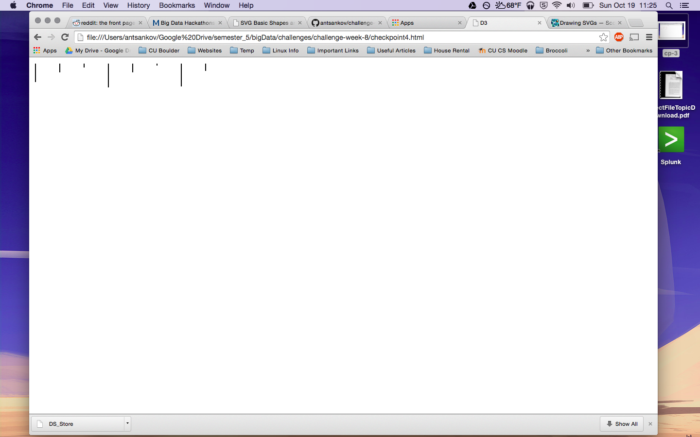

# Name

Alexander Tsankov

# How many points have you earned?

0/100

(Make your own calculation and replace the number 0 with the points you think you've earned.)

# How many hours have you spent on this?

fill-in-your-answer

# What is the most difficult part about this week's challenge?

fill-in-your-answer

# Show and tell (6 points)

## Link (2 points)

[Interesting Big Data visualization ](http://www.psfk.com/2014/10/grillz-algorithm-hip-hop-visualization-exhibit.html)

## Describe briefly the "motivation" and "intended audience" of this public visualization (4 points).

She 3d printed teeth girlls based on infromation from lyrics from different hip hop musicians.

# Checkpoints (5 points x 4 = 20 points)

## 1 (5 points)

[A](cp1-a.html)

[C](cp1-c.html)

[E](cp1-e.html)

## 2 (5 points)

[checkpoint2](cp2.html)

## 3 (5 points)

[checkpoint3](checkpoint-3.html)

## 4 (5 points)

[checkpoint4](checkpoint4.html)

# Challenges

## Challenge 1 (5 points x 4 = 20 points)

### 1.a. (5 points)

[challenge1-a](challenge1-a.html)

### 1.b. (5 points)

[challenge1-b](checkpoint1-b.html)

### 1.c. (5 points)

[challenge1-c](checkpoint1-c.html)

### 1.d. (5 points)

[challenge1-d](checkpoint1-d.html)

## Challenge 2 (5 points x 6 = 30 points)

### 2.a. (5 points)

### 2.b. (5 points)

### 2.c. (5 points)

### 2.d. (5 points)

### 2.e. (5 points)

### 2.f. (5 points)

[challenge2](checkpoint2.html)

## Challenge 3 (8 points x 3 = 24 points)

### 3.a. (8 points)

[challenge3-a](checkpoint3-a.html)

### 3.b. (8 points)

[challenge3-b](checkpoint3-b.html)

### 3.c. (8 points)

[challenge3-c](checkpoint3-c.html)
