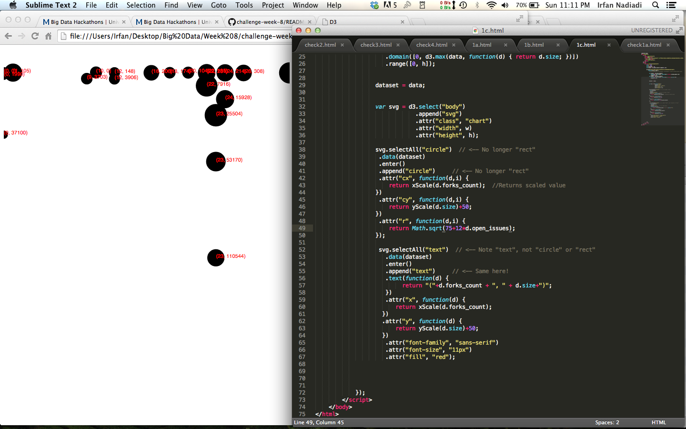

# Name

Irfan Nadiadi

# How many points have you earned?

41/100

(Make your own calculation and replace the number 0 with the points you think you've earned.)

# How many hours have you spent on this?

5

# What is the most difficult part about this week's challenge?

Working with d3 is not too hard, but it really takes quite a lot of time. I have quite a lot of other work to do and was unable to finish this.

# Show and tell (6 points)

## Link (2 points)

[eCLOUD](http://www.ecloudproject.com/)

## Describe briefly the "motivation" and "intended audience" of this public visualization (4 points).

The eCLOUD is an art installation in San Jose International Airport, which features many polycarbonate tiles that fade from transparent to opaque states. The different tiles are activated by real-time weather data from around the world. The installation acts as art more so than a functional representation of the data, but it is still an interesting way to physically represent data. 

# Checkpoints (5 points x 4 = 20 points)

## 1 (5 points)

[checkpoint1 (2a)](check1a.html)

[checkpoint1 (2c)](check1c.html)

[checkpoint1 (2e)](check1e.html)

## 2 (5 points)

[checkpoint2](check2.html)

## 3 (5 points)

[checkpoint3](check3.html)

## 4 (5 points)

[checkpoint4](check4.html)

# Challenges

## Challenge 1 (5 points x 4 = 20 points)

### 1.a. (5 points)

[challenge1-a](1a.html)

### 1.b. (5 points)

[challenge1-b](1b.html)

### 1.c. (5 points)

[challenge1-c](1c.html)

### 1.d. (5 points)

[challenge1-d](checkpoint1-d.html)

## Challenge 2 (5 points x 6 = 30 points)

### 2.a. (5 points)

### 2.b. (5 points)

### 2.c. (5 points)

### 2.d. (5 points)

### 2.e. (5 points)

### 2.f. (5 points)

[challenge2](checkpoint2.html)

## Challenge 3 (8 points x 3 = 24 points)

### 3.a. (8 points)

[challenge3-a](checkpoint3-a.html)

### 3.b. (8 points)

[challenge3-b](checkpoint3-b.html)

### 3.c. (8 points)

[challenge3-c](checkpoint3-c.html)
