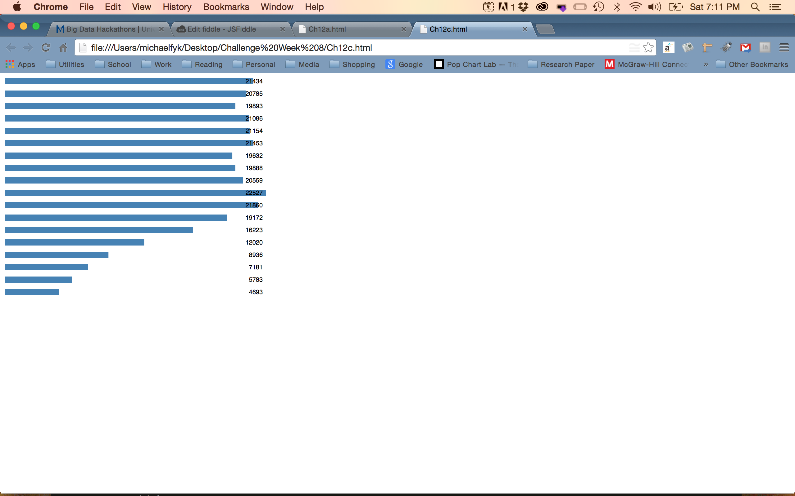
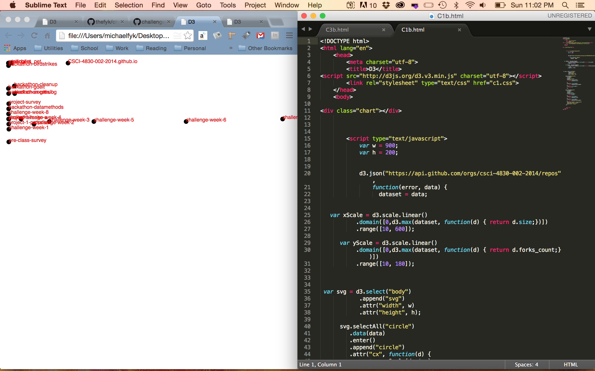

# Name

Michael Fyk

# How many points have you earned?

100/100

(Make your own calculation and replace the number 0 with the points you think you've earned.)

# How many hours have you spent on this?

13

# What is the most difficult part about this week's challenge?

Challenges 3b and 3c.

# Show and tell (6 points)

## Link (2 points)

[title-of-the-article](http://link-to-an-example-of-big-data-visualization-in-a-public-space)

## Describe briefly the "motivation" and "intended audience" of this public visualization (4 points).

fill-in-your-answer

# Checkpoints (5 points x 4 = 20 points)

## 1 (5 points)

[checkpoint1a](Ch12a.html)
[checkpoint1c](Ch12c.html)
[checkpoint1e](Ch12e.html)

## 2 (5 points)

[checkpoint2a](Ch2.html)

## 3 (5 points)

[checkpoint3](Ch3.html)

## 4 (5 points)

[checkpoint4](Ch4.html)

# Challenges

## Challenge 1 (5 points x 4 = 20 points)

### 1.a. (5 points)

[challenge1-a](C1a.html)

### 1.b. (5 points)

[challenge1-b](C1b.html)

### 1.c. (5 points)

[challenge1-c](C1c.html)

### 1.d. (5 points)

[challenge1-d](C1d.html)

## Challenge 2 (5 points x 6 = 30 points)

### 2.a. (5 points)

### 2.b. (5 points)

### 2.c. (5 points)

### 2.d. (5 points)

### 2.e. (5 points)

### 2.f. (5 points)

[challenge2](C2f.html)

## Challenge 3 (8 points x 3 = 24 points)

### 3.a. (8 points)

[challenge3-a](C3a.html)

### 3.b. (8 points)

[challenge3-b](C3b.html)

### 3.c. (8 points)

[challenge3-c](C3c.html)
