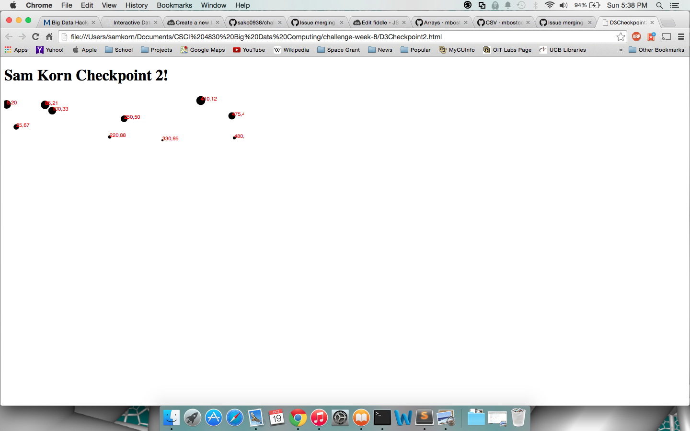
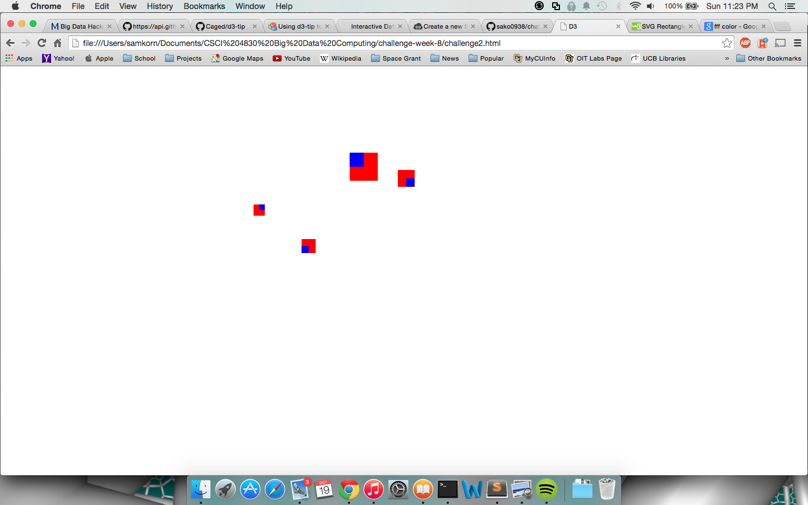

# Name

Sam Korn

# How many points have you earned?

78/100

(Make your own calculation and replace the number 0 with the points you think you've earned.)

# How many hours have you spent on this?

8

# What is the most difficult part about this week's challenge?

In the D3.tsv function, in the example code it provides the parameters (url,type,callback), in jsFiddle it allows the type field to be filled in but not do anything. But in normal HTML this is not the case. Fixing this bug took ~2 hours.

# Show and tell (6 points)

## Link (2 points)

[HeadsUP! Times Square Visualization Challenge](http://www.visualizing.org/contests/groundwater)

## Describe briefly the "motivation" and "intended audience" of this public visualization (4 points).

This visualization was from a contest in order to show a general audience an example of the data about aquifer levels. Currently most of the data about water usage and aquifer levels are meant for experienced hydrologists, and are therefore very difficult to be read be the general population. This visualization is meant to try to convince people to use less water and realize where the water is coming from.

# Checkpoints (5 points x 4 = 20 points)

## 1 (5 points)

[checkpoint1](D3Checkpoint1.html)

## 2 (5 points)

[checkpoint2](D3Checkpoint2.html)

## 3 (5 points)

[checkpoint3](D3Checkpoint3.html)

## 4 (5 points)

[checkpoint4](D3Checkpoint4.html)

# Challenges

## Challenge 1 (5 points x 4 = 20 points)

### 1.a. (5 points)

[challenge1-a](challenge1-a.html)

### 1.b. (5 points)

[challenge1-b](checkpoint1-b.html)

### 1.c. (5 points)

[challenge1-c](checkpoint1-c.html)

### 1.d. (5 points)

[challenge1-d](checkpoint1-d.html)

## Challenge 2 (5 points x 6 = 30 points)

### 2.a. (5 points)

### 2.b. (5 points)

### 2.c. (5 points)

### 2.d. (5 points)

### 2.e. (5 points)

### 2.f. (5 points)

[challenge2](challenge2.html)

## Challenge 3 (8 points x 3 = 24 points)

### 3.a. (8 points)

[challenge3-a](challenge3a.html)

### 3.b. (8 points)

[challenge3-b](challenge3b.html)

### 3.c. (8 points)

[challenge3-c](challenge3c.html)
